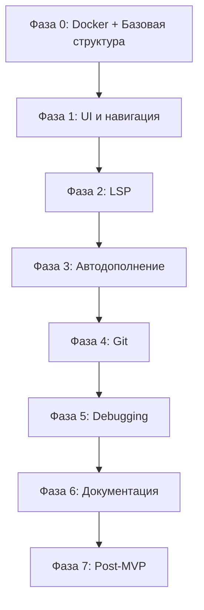

# ROADMAP - Neovim Docker IDE

> **Цель:** Создание MVP для личного использования
> **Целевая аудитория:** Разработчики, переходящие с JetBrains IDE
> **Приоритетные языки:** JavaScript/TypeScript/Vue, PHP

---

## Легенда приоритетов

- 🔴 **P0 - Критический** — Блокирует использование, должно быть в MVP
- 🟠 **P1 - Высокий** — Важно для комфортной работы, желательно в MVP
- 🟡 **P2 - Средний** — Улучшает опыт, можно после MVP
- 🟢 **P3 - Низкий** — Nice to have, долгосрочная перспектива

---

## Фаза 0: Инфраструктура и базовая настройка
**Цель:** Создать работающий Docker-контейнер с базовым Neovim

### 0.1 Docker окружение 🔴 P0
- [ ] Создать `docker/Dockerfile` с базовым образом
  - Установить Neovim 0.10+
  - Установить необходимые утилиты (git, curl, wget, ripgrep, fd)
  - Установить Node.js (для LSP серверов)
  - Установить PHP и Composer
  - Установить Nerd Font в контейнер
- [ ] Создать `docker/docker-compose.yml`
  - Настроить volume монтирование для проектов
  - Настроить volume для персистентных данных Neovim (~/.local/share/nvim)
  - Настроить сеть для возможности доступа к веб-серверам
- [ ] Создать wrapper-скрипт `bin/neovim`
  - Автоматический запуск контейнера
  - Передача аргументов (путь к файлу/проекту)
  - Правильная обработка путей хоста в контейнере
  - Поддержка переменных окружения

**Критерий готовности:** Можно запустить `./bin/neovim .` и открыть пустой Neovim в Docker

---

### 0.2 Базовая структура конфигурации 🔴 P0
- [ ] Создать структуру `nvim/`
  ```
  nvim/
  ├── init.lua
  ├── lua/
  │   ├── config/
  │   │   ├── init.lua
  │   │   ├── options.lua      # Базовые настройки Vim
  │   │   ├── lazy.lua         # Настройка lazy.nvim
  │   │   └── keyboard.lua     # Настройки для русской раскладки
  │   ├── plugins/
  │   │   └── init.lua
  │   ├── keymaps/
  │   │   └── init.lua
  │   └── lsp/
  │       └── init.lua
  ```
- [ ] Настроить `init.lua` для загрузки модулей
- [ ] Настроить базовые опции Vim в `config/options.lua`
  - Нумерация строк
  - Отступы (2/4 пробела)
  - Поиск (игнорирование регистра, подсветка)
  - Буфер обмена системы
  - Undo history
  - Цветовая поддержка (termguicolors)

**Критерий готовности:** Neovim запускается с базовыми настройками

---

### 0.3 Установка менеджера плагинов 🔴 P0
- [ ] Интегрировать [lazy.nvim](https://github.com/folke/lazy.nvim)
  - Автоматическая установка при первом запуске
  - Настройка автозагрузки плагинов
  - Создать `lua/config/lazy.lua` с конфигурацией

**Критерий готовности:** `:Lazy` открывает менеджер плагинов

---

## Фаза 1: Базовый функционал для работы
**Цель:** Минимально работающая IDE для редактирования кода

### 1.1 Файловый менеджер 🔴 P0
- [ ] Установить и настроить [nvim-tree.lua](https://github.com/nvim-tree/nvim-tree.lua)
  - Отображение файлового дерева
  - Иконки файлов (через nvim-web-devicons)
  - Базовые операции (создание, удаление, переименование)
  - Git статус в дереве
- [ ] Настроить хоткеи
  - `<Leader>e` — Toggle файловый менеджер
  - `<Leader>ef` — Focus на файловый менеджер
  - В дереве: `a` (создать), `d` (удалить), `r` (переименовать), `x` (вырезать), `p` (вставить)

**Критерий готовности:** Можно открыть проект и навигироваться по файлам через дерево

---

### 1.2 Fuzzy поиск (Telescope) 🔴 P0
- [ ] Установить [telescope.nvim](https://github.com/nvim-telescope/telescope.nvim)
  - Плагины: plenary.nvim (зависимость)
  - Настроить ripgrep для быстрого поиска
- [ ] Настроить базовые функции
  - Поиск файлов по имени
  - Поиск по содержимому (grep)
  - Поиск в открытых буферах
  - Поиск в истории команд
- [ ] Настроить хоткеи
  - `<Leader>ff` — Find files
  - `<Leader>fg` — Find grep (поиск по содержимому)
  - `<Leader>fb` — Find buffers
  - `<Leader>fh` — Find help
  - `<Leader>fr` — Find recent files

**Критерий готовности:** Быстрый поиск файлов и содержимого работает корректно

---

### 1.3 Цветовая схема и внешний вид 🔴 P0
- [ ] Установить тему [tokyonight.nvim](https://github.com/folke/tokyonight.nvim) или [catppuccin](https://github.com/catppuccin/nvim)
- [ ] Установить [lualine.nvim](https://github.com/nvim-lualine/lualine.nvim) (строка состояния)
  - Показывать режим Vim
  - Показывать Git ветку
  - Показывать язык/LSP статус
  - Показывать позицию в файле
- [ ] Установить [bufferline.nvim](https://github.com/akinsho/bufferline.nvim) (вкладки)
  - Визуальное отображение открытых буферов
  - Индикаторы изменений
- [ ] Настроить Nerd Fonts
- [ ] Настроить true color в терминале

**Критерий готовности:** Красивый и информативный интерфейс

---

### 1.4 Базовые хоткеи и русская раскладка 🔴 P0
- [ ] Настроить `langmap` для работы с русской раскладкой в Normal mode
  ```lua
  vim.opt.langmap = 'ФИСВУАПРШОЛДЬТЩЗЙКЫЕГМЦЧНЯ;ABCDEFGHIJKLMNOPQRSTUVWXYZ,фисвуапршолдьтщзйкыегмцчня;abcdefghijklmnopqrstuvwxyz'
  ```
- [ ] Настроить базовые хоткеи в `keymaps/init.lua`
  - Навигация по окнам: `<C-h/j/k/l>`
  - Управление вкладками: `<Leader>tn/tc`, `gt/gT`
  - Сохранение: `<C-s>` или `<Leader>w`
  - Выход: `<Leader>q`
  - Split окна: `<Leader>sv` (vertical), `<Leader>sh` (horizontal)

**Критерий готовности:** Все базовые операции работают на обеих раскладках

---

## Фаза 2: LSP и интеллектуальные возможности
**Цель:** Полноценная поддержка языков программирования

### 2.1 LSP базовая настройка 🔴 P0
- [ ] Установить [nvim-lspconfig](https://github.com/neovim/nvim-lspconfig)
- [ ] Установить [mason.nvim](https://github.com/williamboman/mason.nvim) — менеджер LSP серверов
- [ ] Установить [mason-lspconfig.nvim](https://github.com/williamboman/mason-lspconfig.nvim) — интеграция
- [ ] Создать `lua/lsp/init.lua` с базовой конфигурацией
- [ ] Настроить общие хоткеи для LSP
  - `gd` — Go to Definition
  - `gD` — Go to Declaration
  - `gr` — Find References (через Telescope)
  - `gi` — Go to Implementation
  - `K` — Hover documentation
  - `<Leader>rn` — Rename symbol
  - `<Leader>ca` — Code Actions
  - `[d` / `]d` — Prev/Next diagnostic

**Критерий готовности:** LSP инфраструктура готова к добавлению серверов

---

### 2.2 JavaScript/TypeScript/Vue LSP 🔴 P0
- [ ] Установить и настроить `ts_ls` (TypeScript Language Server)
  - Автоустановка через Mason
  - Настройки для JavaScript и TypeScript
- [ ] Установить и настроить `volar` (Vue Language Server)
  - Полная поддержка Vue 3 SFC
  - Интеграция с TypeScript
  - Автоимпорты компонентов
- [ ] Установить и настроить `eslint` LSP
  - Автофиксы на сохранение (опционально)
- [ ] Установить дополнительные инструменты
  - Prettier для форматирования
  - Настроить автоформатирование при сохранении

**Критерий готовности:** Полная поддержка JS/TS/Vue с автодополнением и диагностикой

---

### 2.3 PHP LSP 🔴 P0
- [ ] Установить и настроить `intelephense` (PHP Language Server)
  - Автоустановка через Mason
  - Поддержка PSR стандартов
  - Работа с Composer dependencies
- [ ] Настроить PHP CS Fixer или PHP_CodeSniffer
  - Автоформатирование при сохранении
  - Проверка стиля кода
- [ ] Настроить Xdebug (базовая подготовка, полная настройка в Фазе 3)

**Критерий готовности:** Полная поддержка PHP с автодополнением, навигацией и диагностикой

---

### 2.4 HTML/CSS/JSON/YAML LSP 🟠 P1
- [ ] Установить `html` LSP
- [ ] Установить `cssls` (CSS Language Server)
  - Поддержка CSS/SCSS/LESS
- [ ] Установить `jsonls` (JSON Language Server)
- [ ] Установить `yamlls` (YAML Language Server)
- [ ] Установить Emmet поддержку для HTML/CSS

**Критерий готовности:** Поддержка всех веб-технологий

---

## Фаза 3: Автодополнение и продуктивность
**Цель:** Комфортное написание кода с автодополнением

### 3.1 Автодополнение (nvim-cmp) 🔴 P0
- [ ] Установить [nvim-cmp](https://github.com/hrsh7th/nvim-cmp)
- [ ] Установить источники автодополнения
  - `cmp-nvim-lsp` — из LSP
  - `cmp-buffer` — из открытых буферов
  - `cmp-path` — пути к файлам
  - `cmp-cmdline` — командная строка Vim
- [ ] Настроить UI автодополнения
  - Красивое меню с иконками
  - Документация рядом с подсказками
  - Навигация `<C-n>/<C-p>` или `<Tab>/<S-Tab>`
- [ ] Интегрировать с LSP

**Критерий готовности:** Работающее автодополнение из всех источников

---

### 3.2 Snippets 🟠 P1
- [ ] Установить [LuaSnip](https://github.com/L3MON4D3/LuaSnip)
- [ ] Установить `cmp-luasnip` (интеграция с nvim-cmp)
- [ ] Установить [friendly-snippets](https://github.com/rafamadriz/friendly-snippets) — готовые сниппеты
- [ ] Создать папку `nvim/snippets/` для пользовательских сниппетов
- [ ] Добавить базовые сниппеты для:
  - JavaScript/TypeScript (console.log, функции, классы)
  - Vue (template, script, style blocks)
  - PHP (class, function, namespace, use)

**Критерий готовности:** Работающие сниппеты с автодополнением

---

### 3.3 GitHub Copilot 🟡 P2
- [ ] Установить [copilot.vim](https://github.com/github/copilot.vim)
- [ ] Настроить аутентификацию
- [ ] Настроить хоткеи
  - `<Tab>` или `<C-]>` — Accept suggestion
  - `<C-[>` — Dismiss suggestion
  - `<Leader>cp` — Toggle Copilot

**Критерий готовности:** Copilot предлагает код (если есть подписка)

---

### 3.4 Treesitter для подсветки синтаксиса 🔴 P0
- [ ] Установить [nvim-treesitter](https://github.com/nvim-treesitter/nvim-treesitter)
- [ ] Настроить парсеры для языков
  - JavaScript, TypeScript, Vue
  - PHP, HTML, CSS, SCSS
  - JSON, YAML, TOML, Markdown
  - Lua (для конфигурации Neovim)
- [ ] Включить возможности Treesitter
  - Подсветка синтаксиса
  - Умные отступы
  - Инкрементальное выделение (visual mode)
- [ ] Установить [nvim-ts-context-commentstring](https://github.com/JoosepAlviste/nvim-ts-context-commentstring) для правильных комментариев в Vue

**Критерий готовности:** Красивая и точная подсветка синтаксиса для всех языков

---

## Фаза 4: Git интеграция
**Цель:** Комфортная работа с Git

### 4.1 Git базовая интеграция 🔴 P0
- [ ] Установить [gitsigns.nvim](https://github.com/lewis6991/gitsigns.nvim)
  - Индикаторы изменений в gutter
  - Подсветка измененных строк
  - Git blame для текущей строки
- [ ] Настроить хоткеи
  - `]c` / `[c` — Next/Prev hunk
  - `<Leader>hs` — Stage hunk
  - `<Leader>hu` — Undo stage hunk
  - `<Leader>hr` — Reset hunk
  - `<Leader>hp` — Preview hunk
  - `<Leader>hb` — Blame line (toggle)
  - `<Leader>hd` — Diff this

**Критерий готовности:** Видно изменения Git, можно работать с hunks

---

### 4.2 Fugitive или Neogit 🟡 P2
- [ ] Установить [vim-fugitive](https://github.com/tpope/vim-fugitive) или [neogit](https://github.com/NeogitOrg/neogit)
- [ ] Настроить команды
  - `:Git` или `:Neogit` — открыть Git интерфейс
  - `<Leader>gs` — Git status
  - `<Leader>gc` — Git commit
  - `<Leader>gp` — Git push
  - `<Leader>gl` — Git log

**Критерий готовности:** Можно делать коммиты прямо из Neovim

---

## Фаза 5: Отладка и расширенные возможности
**Цель:** Debugging и дополнительные IDE-функции

### 5.1 DAP (Debug Adapter Protocol) 🟠 P1
- [ ] Установить [nvim-dap](https://github.com/mfussenegger/nvim-dap)
- [ ] Установить [nvim-dap-ui](https://github.com/rcarriga/nvim-dap-ui) — UI для отладки
- [ ] Установить [nvim-dap-virtual-text](https://github.com/theHamsta/nvim-dap-virtual-text) — показ переменных
- [ ] Настроить адаптеры
  - `vscode-js-debug` для JavaScript/TypeScript
  - `php-debug-adapter` для PHP/Xdebug
- [ ] Настроить хоткеи
  - `<F5>` — Start/Continue debugging
  - `<F9>` — Toggle breakpoint
  - `<F10>` — Step over
  - `<F11>` — Step into
  - `<F12>` — Step out
  - `<Leader>db` — Debug: breakpoints list
  - `<Leader>dr` — Debug: REPL

**Критерий готовности:** Можно отлаживать JS/TS/PHP код с breakpoints

---

### 5.2 Xdebug для PHP 🟠 P1
- [ ] Настроить PHP Xdebug в Docker контейнере
  - Установить расширение xdebug
  - Настроить php.ini для remote debugging
  - Настроить порт 9003
- [ ] Настроить nvim-dap для работы с Xdebug
- [ ] Создать конфигурацию для Laravel/Symfony проектов
- [ ] Документировать процесс настройки

**Критерий готовности:** Работающий debug для PHP приложений

---

### 5.3 Комментарии и окружение 🟠 P1
- [ ] Установить [Comment.nvim](https://github.com/numToStr/Comment.nvim)
  - Быстрое комментирование/раскомментирование
  - Поддержка всех языков
  - Хоткеи: `gcc` (строка), `gc` (visual mode), `gbc` (block)
- [ ] Установить [nvim-surround](https://github.com/kylechui/nvim-surround)
  - Работа с парными символами (кавычки, скобки, теги)
  - `ys{motion}{char}` — добавить окружение
  - `ds{char}` — удалить окружение
  - `cs{old}{new}` — изменить окружение

**Критерий готовности:** Удобная работа с комментариями и парными символами

---

### 5.4 Навигация по символам (outline) 🟡 P2
- [ ] Установить [aerial.nvim](https://github.com/stevearc/aerial.nvim) или [symbols-outline.nvim](https://github.com/simrat39/symbols-outline.nvim)
- [ ] Настроить отображение структуры кода
  - Классы, методы, функции, переменные
  - Интеграция с LSP и Treesitter
- [ ] Хоткей `<Leader>o` — Toggle outline

**Критерий готовности:** Можно видеть структуру файла и навигироваться по символам

---

## Фаза 6: Документация и polish
**Цель:** Завершение MVP, документация, удобство использования

### 6.1 Интерактивный хелпер (which-key) 🔴 P0
- [ ] Установить [which-key.nvim](https://github.com/folke/which-key.nvim)
- [ ] Настроить все группы хоткеев с описаниями
  - `<Leader>f` — Find (файлы, grep, буферы)
  - `<Leader>g` — Git операции
  - `<Leader>d` — Debug операции
  - `<Leader>t` — Tabs/terminals
  - `<Leader>c` — Code operations (LSP)
  - `<Leader>h` — Git hunks
- [ ] Настроить задержку показа подсказок (300-500ms)
- [ ] Добавить иконки для визуальной группировки

**Критерий готовности:** При нажатии `<Leader>` появляется подсказка со всеми доступными хоткеями

---

### 6.2 Встроенный терминал 🟠 P1
- [ ] Установить [toggleterm.nvim](https://github.com/akinsho/toggleterm.nvim)
- [ ] Настроить плавающий терминал
  - Хоткей `<C-\>` — Toggle terminal
  - Несколько терминалов (`<Leader>t1`, `<Leader>t2`)
  - Вертикальный/горизонтальный split
- [ ] Настроить удобные команды
  - `:LazyGit` — открыть lazygit в терминале
  - `:Htop` — открыть htop

**Критерий готовности:** Быстрый доступ к терминалу из Neovim

---

### 6.3 Автосохранение и сессии 🟡 P2
- [ ] Установить [auto-session](https://github.com/rmagatti/auto-session)
  - Автоматическое сохранение сессий по проектам
  - Восстановление открытых файлов и layout
- [ ] Установить [persistence.nvim](https://github.com/folke/persistence.nvim) (альтернатива)
- [ ] Хоткеи для управления сессиями
  - `<Leader>qs` — Save session
  - `<Leader>qr` — Restore session
  - `<Leader>ql` — Load last session

**Критерий готовности:** Можно продолжить работу с того же места после перезапуска

---

### 6.4 Документация 🔴 P0
- [ ] Создать `docs/INSTALLATION.md`
  - Требования к системе
  - Установка Docker
  - Быстрый старт
  - Решение частых проблем при установке
- [ ] Создать `docs/KEYBINDINGS.md`
  - Полная таблица всех хоткеев с описаниями
  - Группировка по функциональности
  - Советы для новичков в Vim
- [ ] Создать `docs/CUSTOMIZATION.md`
  - Как изменить хоткеи
  - Как добавить новые темы
  - Как добавить новые LSP серверы
  - Как настроить плагины
- [ ] Создать `docs/TROUBLESHOOTING.md`
  - Проблемы с Docker
  - Проблемы с LSP
  - Проблемы с цветами и шрифтами
  - Проблемы с Xdebug
  - FAQ
- [ ] Создать `docs/VIM_FOR_BEGINNERS.md`
  - Основы Vim для новичков
  - Режимы (Normal, Insert, Visual, Command)
  - Базовые движения (hjkl, w/b, gg/G)
  - Копирование/вставка
  - Поиск и замена
  - Основные команды

**Критерий готовности:** Полная документация для начала работы

---

### 6.5 Финальная полировка 🟠 P1
- [ ] Оптимизация времени запуска
  - Lazy loading плагинов
  - Профилирование с помощью `:Lazy profile`
- [ ] Тестирование на разных проектах
  - Vue.js проект
  - Laravel проект
  - Symfony проект
  - TypeScript/NestJS проект
- [ ] Проверка работы всех хоткеев на русской раскладке
- [ ] Создать `.editorconfig` для консистентности
- [ ] Создать `CHANGELOG.md` для отслеживания изменений
- [ ] Добавить скриншоты в README.md

**Критерий готовности:** MVP полностью готов к использованию

---

## Фаза 7: Post-MVP улучшения
Реализуется по необходимости после завершения MVP

### 7.1 Дополнительные языки 🟢 P3
- [ ] Python (pyright или pylsp)
- [ ] Docker (dockerfile-language-server)
- [ ] SQL (sqls)

### 7.2 Нативный режим (без Docker) 🟡 P2
- [ ] Создать `docs/NATIVE_SETUP.md`
  - Установка Neovim на macOS/Linux
  - Установка всех зависимостей
  - Настройка путей
- [ ] Создать инсталляционный скрипт `bin/install-native.sh`
- [ ] Тестирование на разных ОС

### 7.3 Расширенные возможности 🟢 P3
- [ ] Интеграция с AI
  - ChatGPT через плагин
  - Copilot Chat
- [ ] Профили конфигурации
  - Frontend профиль (JS/TS/Vue)
  - Backend профиль (PHP/Laravel)
  - Fullstack профиль (все вместе)
- [ ] Web UI для настройки (очень низкий приоритет)
- [ ] Docker Compose проекты поддержка
- [ ] Автоопределение типа проекта
- [ ] Интеграция с облачными сервисами

### 7.4 Testing поддержка 🟡 P2
- [ ] [neotest](https://github.com/nvim-neotest/neotest) — тестовый раннер
  - neotest-jest для JavaScript
  - neotest-phpunit для PHP
- [ ] Хоткеи для запуска тестов
  - `<Leader>tt` — Run nearest test
  - `<Leader>tf` — Run file tests
  - `<Leader>ts` — Test summary
- [ ] Coverage отображение

---

## Метрики успеха MVP

### Функциональные требования
- ✅ Docker контейнер запускается одной командой
- ✅ Можно открыть проект и начать редактировать код
- ✅ Работает автодополнение для JS/TS/Vue/PHP
- ✅ Работает навигация (go to definition, find references)
- ✅ Работает поиск файлов и по содержимому
- ✅ Работают все хоткеи на русской раскладке
- ✅ Git интеграция показывает изменения
- ✅ Можно настроить breakpoints и дебажить код
- ✅ Интерактивный хелпер показывает все доступные команды

### Нефункциональные требования
- ✅ Время запуска Neovim < 1 секунды
- ✅ Отзывчивость автодополнения < 200ms
- ✅ Полная документация для новичков
- ✅ Красивый и консистентный UI
- ✅ Работает на macOS, Linux, Windows (WSL2)

---

## Риски и митигация

### Риск 1: Сложность настройки Docker
**Вероятность:** Средняя
**Влияние:** Высокое (блокирует использование)
**Митигация:**
- Тщательное тестирование на разных системах
- Подробная документация по установке
- Готовые скрипты для автоматизации

### Риск 2: Медленная работа LSP
**Вероятность:** Средняя
**Влияние:** Среднее (ухудшает опыт)
**Митигация:**
- Настройка debounce для диагностики
- Lazy loading LSP серверов
- Оптимизация конфигурации

### Риск 3: Проблемы с Xdebug в Docker
**Вероятность:** Высокая
**Влияние:** Среднее
**Митигация:**
- Создать pre-configured docker-compose.override.yml
- Детальная документация по настройке
- Готовые примеры для Laravel/Symfony

### Риск 4: Кривая обучения Vim для новичков
**Вероятность:** Высокая
**Влияние:** Высокое (отказ от использования)
**Митигация:**
- Создать подробный гайд для новичков
- Интерактивный хелпер (which-key)
- Настроить хоткеи максимально похоже на JetBrains IDE
- Добавить cheatsheet в документацию

---

## Зависимости между задачами



**Критический путь:**
Фаза 0 → Фаза 1 → Фаза 2 → Фаза 3 → Фаза 6 (документация)

**Параллельно можно делать:**
- Фаза 4 (Git) может идти параллельно с Фазой 3
- Фаза 5 (Debugging) можно начинать после завершения LSP

---

## Следующие шаги

1. ⚡ **Немедленно начать:** Фаза 0.1 — создать Docker окружение
2. 📝 **Завести GitHub проект** с этим ROADMAP
3. 🏗️ **Создать issues** для каждой задачи P0 и P1
4. 📊 **Настроить GitHub Projects** для трекинга прогресса
5. 🚀 **Начать разработку** по приоритетам

---

**Обновлено:** 2025-10-28
**Версия:** 1.0 (MVP Plan)
**Статус:** Planning → Ready to Start
